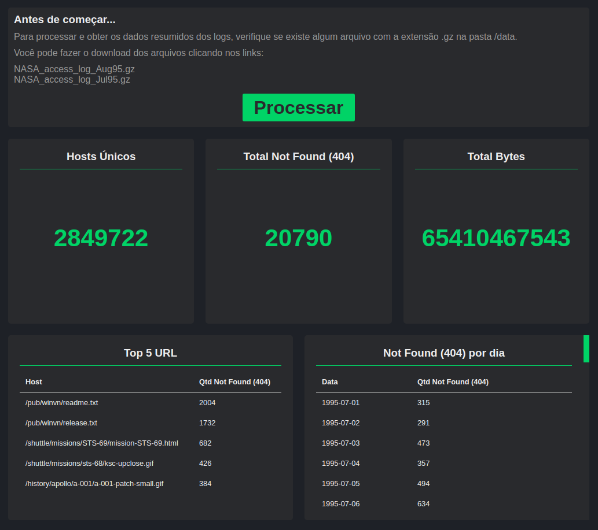

# Nasa Log Summary

Aplicação desenvolvida para exibição dos dados resumidos dos logs da NASA Kennedy Space Center. A aplicação está dividida em duas partes, um servidor back-end desenvolvido em Java + Spring Boot + Spark e um front-end desenvolvido em ReactJs.



## Instalação back-end
### Requisitos

* Java (desenvolvido utilizando a versão 11.0.6)
* Maven (desenvolvido utilizando a versão 3.6.3)

### Instalação

1- Executar o comando para baixar as dependencias e criar o executável:

```
mvn package
```

2- Iniciar o servidor:

```
mvn spring-boot:run
```

### Testando a aplicação

Para testar a aplicação há duas maneiras, inicializando o servidor front-end ou fazendo uma chamada direta a API:

```
http://localhost:8080/logs/process [GET]
```


_**OBS: Verifique se o servidor front-end esta inicializado no host http://localhost:3000, caso seja outro atualizar a propriedade security.allowed-origins no arquivo application.properties**_


## Instalação front-end
### Requisitos

* NodeJs (desenvolvido utilizando a versão 10.16.0)
* Yarn (opcional)

### Instalação

1- Executar o comando para baixar as dependencias:

```
npm install
```
ou 
```
yarn install
```

2- Iniciar o servidor:

```
npm start
```
ou 
```
yarn start
```

_**OBS: Verifique se o servidor back-end esta inicializado no host http://localhost:8080, caso seja outro atualizar o arquivo api.js**_